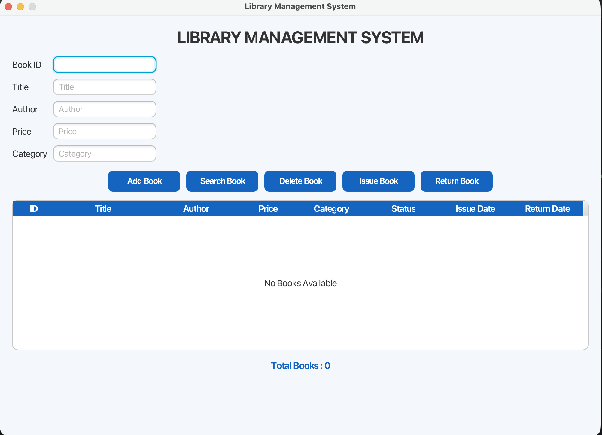
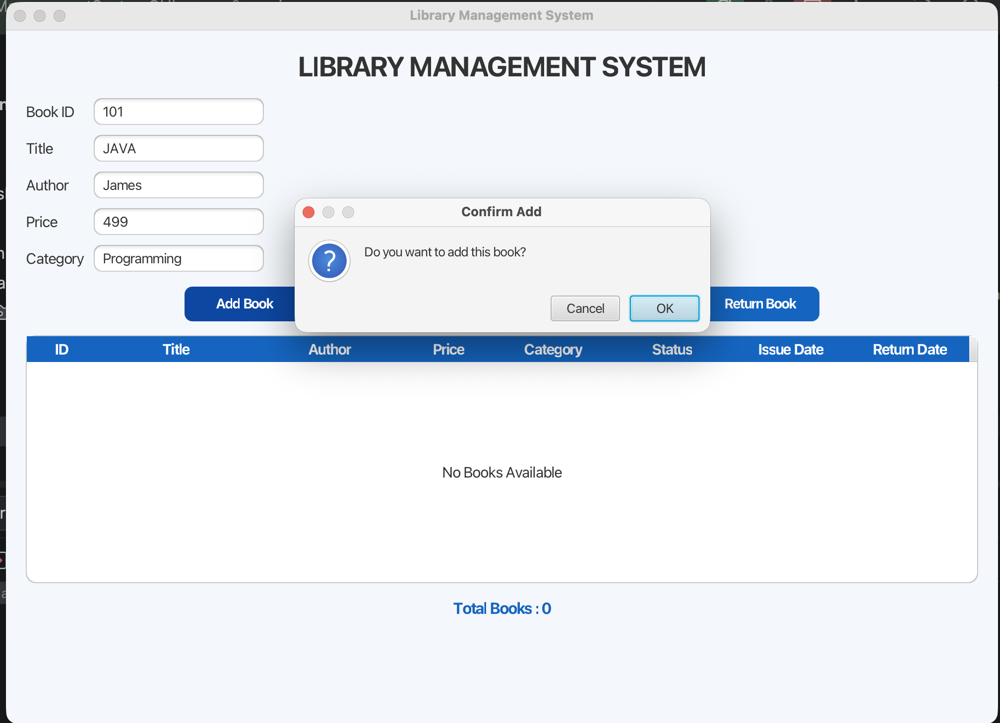
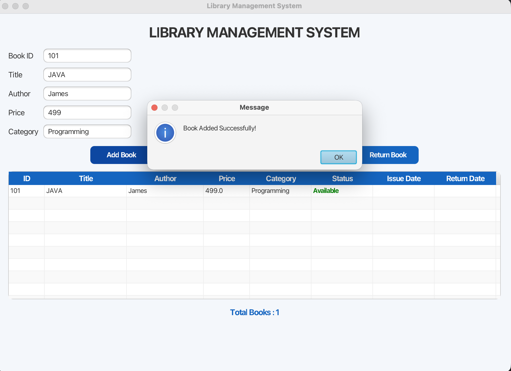
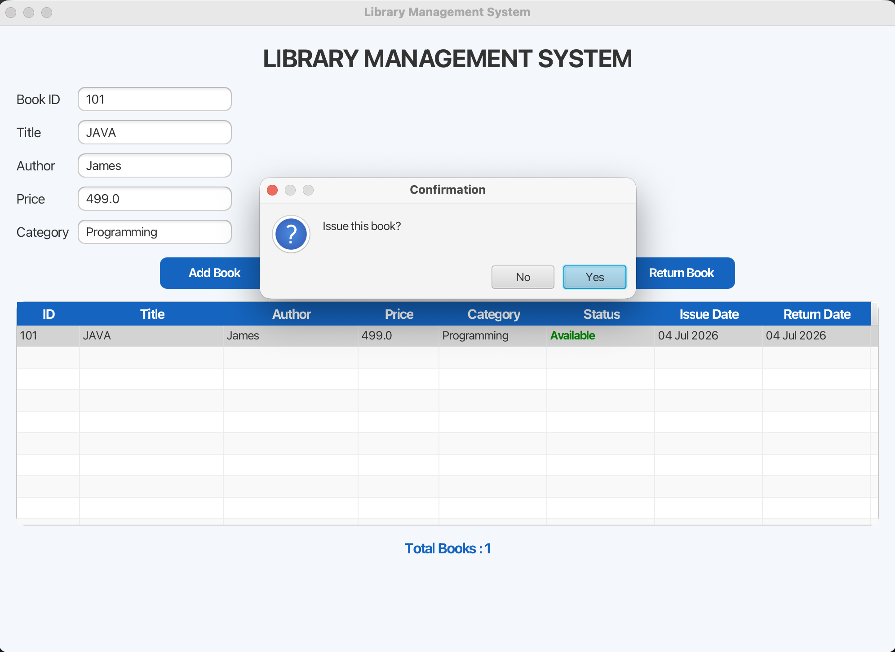
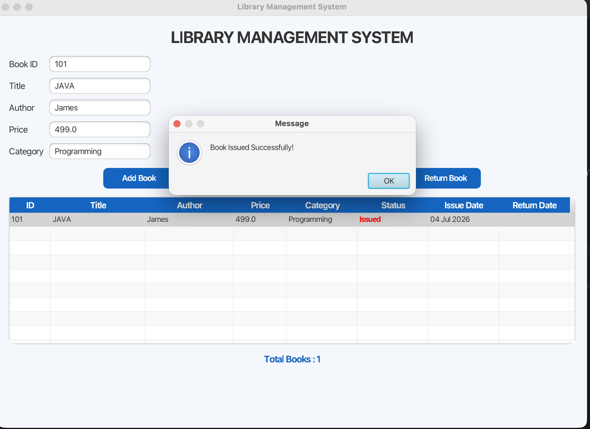
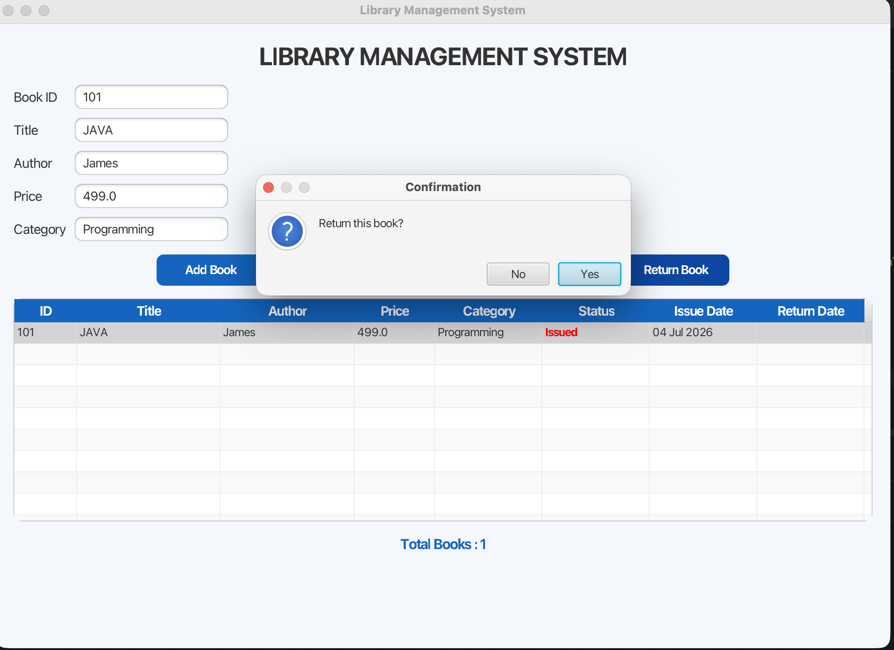
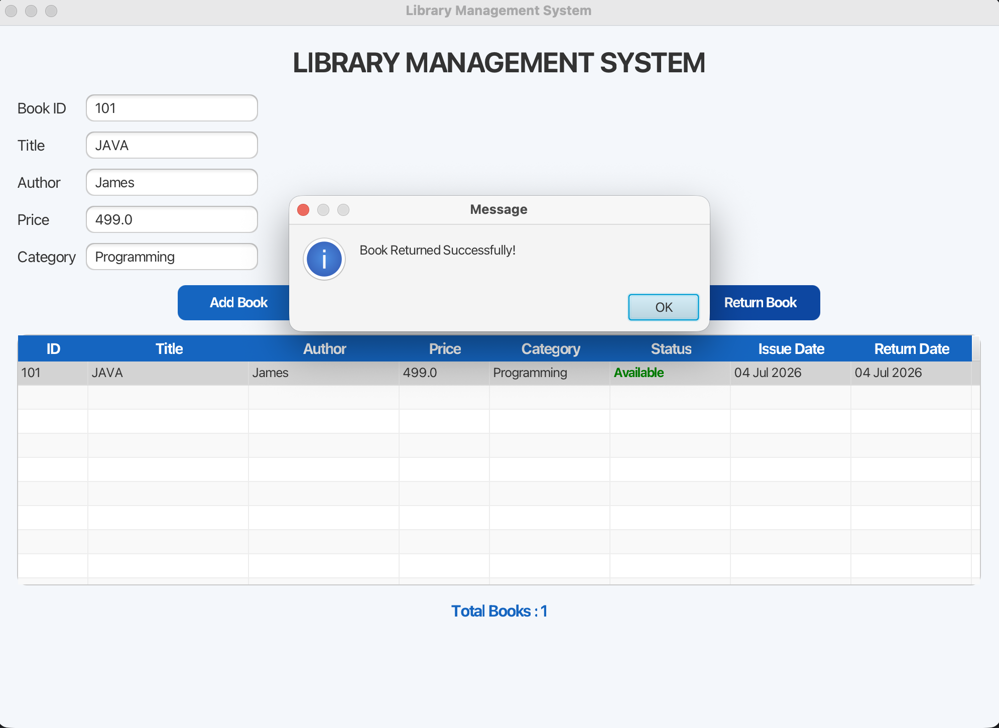
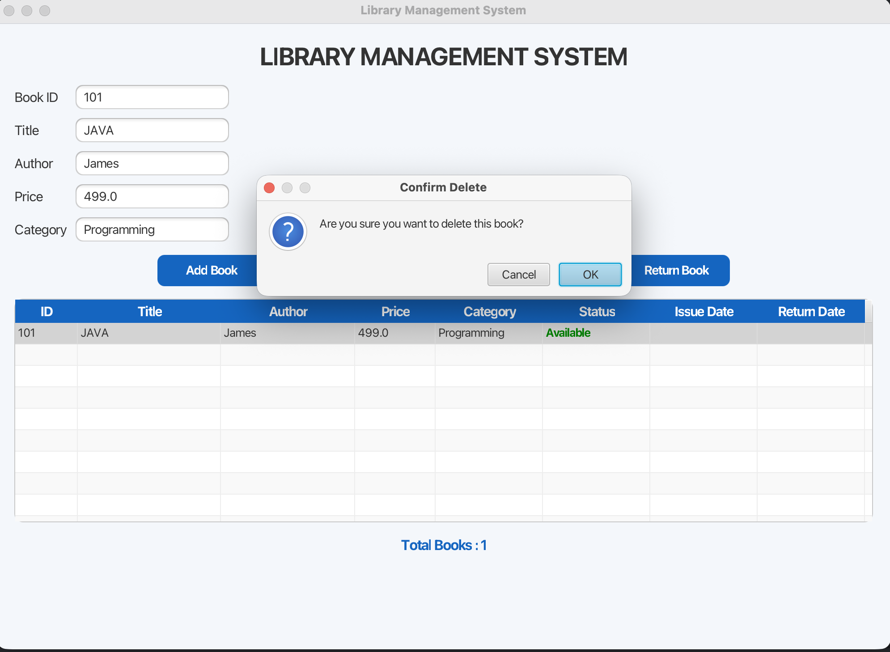
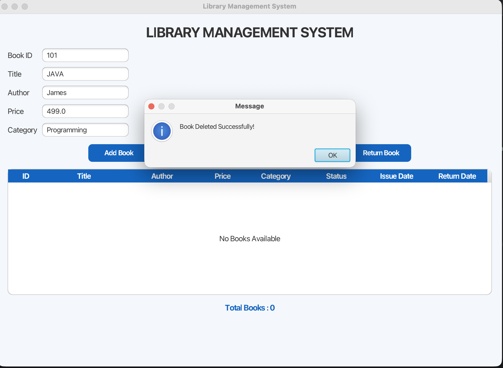

# 📚 Library Management System (JavaFX)

A modern **Library Management System** developed using **Java**, **JavaFX**, **FXML**, **CSS**, and **Object-Oriented Programming (OOP)** principles.

---

## 🚀 Features

- ➕ Add New Book
- 🔍 Search Book by Book ID
- ❌ Delete Book
- 📕 Issue Book
- 📗 Return Book
- 📊 Display Total Number of Books
- ✅ Duplicate Book ID Validation
- 🟢 Book Status (Available / Issued)
- 📅 Issue Date Tracking
- 📅 Return Date Tracking
- 🎨 JavaFX GUI with CSS Styling
- 📋 TableView for Book Management
- ⚠️ Input Validation
- ✔️ Confirmation Dialogs

---

## 🛠️ Technologies Used

- Java
- JavaFX
- FXML
- CSS
- Maven
- IntelliJ IDEA
- Git & GitHub
- Object-Oriented Programming (OOP)

---

## 📂 Project Structure

```text
src/
├── main/
│   ├── java/
│   │   └── com/example/librarymanagementsystemgui/
│   │       ├── BOOK.java
│   │       ├── Library.java
│   │       ├── LibraryController.java
│   │       ├── LibraryApplication.java
│   │       └── Launcher.java
│   └── resources/
│       └── com/example/librarymanagementsystemgui/
│           ├── library-view.fxml
│           └── style.css
```
## 📸 Application Preview

### 1. Home Screen


### 2. Add Book Confirmation


### 3. Book Added Successfully


### 4. Issue Book Confirmation


### 5. Book Issued Successfully


### 6. Return Book Confirmation


### 7. Book Returned Successfully


### 8. Delete Book Confirmation


### 9. Book Deleted Successfully

---

## ▶️ How to Run

1. Clone this repository.
2. Open it in IntelliJ IDEA.
3. Configure JavaFX if required.
4. Run `LibraryApplication.java`.

---

## 📖 Concepts Used

- Object-Oriented Programming
- JavaFX
- FXML
- CSS
- MVC Pattern
- ArrayList
- Event Handling
- Exception Handling
- LocalDate API
- TableView

---

## 🔮 Future Improvements

- MySQL Database Integration
- Login System
- Fine Calculation
- File Handling
- Book Categories
- Dashboard

---

## 🎓 Academic Project

Developed as part of the **Object-Oriented Programming (OOP)** coursework at **Jaypee University of Information Technology (JUIT), Solan**.

---

## 👨‍💻 Author

**Lovish Sharma**

B.Tech Computer Science & Engineering

Jaypee University of Information Technology (JUIT), Solan